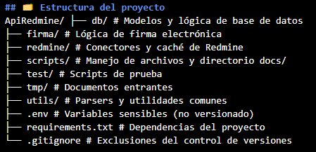

# ApiRedmine
Sistema modular de automatización para Redmine enfocado en flujos de firma electrónica y gestión documental.

---

## 🧩 Descripción
`ApiRedmine` automatiza la gestión de documentos generados en Redmine, incorporando funcionalidades como:

- Identificación de responsables desde campos personalizados
- Extracción de datos desde la API de Redmine
- Almacenamiento en base de datos local
- Envío de correos electrónicos con enlaces únicos de firma
- Control de flujo de estados: pendiente, firmado, rechazado

Diseñado para integrarse con entornos productivos sin depender de plugins de Redmine.

---

## 🗂️ Estructura del proyecto

---

## ⚙️ Requisitos

- Python 3.10+
- Acceso API Redmine con token válido
- Servidor SMTP (para enviar correos)
- `sqlite` (por defecto) o configuración para MySQL

---

## 🚀 Instalación

📍 **ENTORNO: Remoto (VM Ubuntu)**
# Clonar el repositorio
git clone https://github.com/kogik1972/ApiRedmine.git
cd ApiRedmine

# Crear entorno virtual
python3 -m venv venv
source venv/bin/activate

# Instalar dependencias
pip install -r requirements.txt

# Crear .env (ver ejemplo abajo)
cp .env.example .env

#🔐 Archivo .env (ejemplo)
# Redmine
REDMINE_URL=https://redmine.ejemplo.cl
REDMINE_API_KEY=tu_token_api

# Correo
MAIL_SERVER=smtp.tuempresa.cl
MAIL_PORT=587
MAIL_USE_TLS=true
MAIL_USERNAME=correo@tuempresa.cl
MAIL_PASSWORD=clavecorreo
MAIL_DEFAULT_SENDER=correo@tuempresa.cl

# Base URL de la firma
BASE_URL_FIRMA=https://firma.ejemplo.cl

# Conexión a BD si se usa otra
DATABASE_URL=sqlite:///instance/firma.db

#📄 Ejecución básica
python3 firma/core_firma.py \
  --issue_id 1234 \
  --directorio tmp/documentos \
  --nombre_documento contrato.pdf

---

## 📦 Versión 2.0.0 - Firma Electrónica Completa con Web de Validación

Este sistema permite automatizar el flujo completo de firma electrónica de documentos en coordinación con Redmine, incluyendo notificaciones por correo, validación vía web y trazabilidad completa en base de datos.

### Funcionalidades destacadas

- Generación automática de documentos PDF desde Redmine
- Envío de correos personalizados con enlaces de aprobación/rechazo
- Validación web segura con tokens únicos
- Registro y trazabilidad de firmas en base de datos
- Actualización automática del estado del documento en Redmine

### Documentación

📄 [Changelog versión 2.0.0 (PDF)](CHANGELOG_v2.0.0_FirmaElectronica.pdf)

🌐 Subdominio en producción: [https://condominium.eproc-chile.cl](https://condominium.eproc-chile.cl)

✅ Cliente validó el sistema en producción

---
